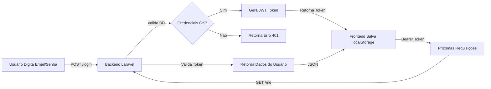

# 🎉 UaiiPonto - Sistema de Gestão de Ponto

Bem-vindo! Sua aplicação de **batida de ponto** está totalmente integrada frontend + backend!

---

## 📌 Status

✅ **Integração Completa** - Frontend e Backend comunicando via API REST  
✅ **Autenticação** - Sistema de registro/login implementado  
✅ **Banco de Dados** - Migrations prontas (users, time_entries, reports)  
✅ **CORS** - Configurado para comunicação entre localhost:3000 e localhost:8000  

---

## 🚀 Começar Agora (3 passos)

### 1️⃣ Abrir 2 Terminais

**Terminal 1 - Backend:**
```bash
cd UaiiPonto/Backend
php artisan serve
```

**Terminal 2 - Frontend:**
```bash
cd UaiiPonto/Frontend
php -S localhost:3000
```

### 2️⃣ Abrir no Navegador
```
http://localhost:3000/pages/login.html
```

### 3️⃣ Testar (veja "Teste Rápido" abaixo)

---

## 🧪 Teste Rápido (2 minutos)

1. Clique em **"Já tem conta? Login"** para ir para cadastro
2. Preencha com dados fictícios:
   - Nome: seu nome
   - Email: seu@email.com
   - Organização: sua empresa
   - Senha: senha123
3. Clique em **"Concluir"**
4. Se aparecer ✅ mensagem de sucesso → **Integração funcionando!**
5. Agora faça login com as credenciais criadas

---

## 📚 Documentação Completa

| Documento | Descrição |
|-----------|-----------|
| **STATUS_INTEGRACAO.md** | 📊 Visão geral completa (LEIA PRIMEIRO!) |
| **GUIA_INTEGRACAO_RAPIDO.md** | 📖 Passo-a-passo em detalhes |
| **TESTES_RAPIDOS.md** | 🧪 Exemplos com cURL e navegador |
| **CHECKLIST_VALIDACAO.md** | ✅ Checklist para validar tudo |
| **iniciar.ps1** | 🚀 Script PowerShell (abrir e executar) |
| **iniciar.bat** | 🚀 Script CMD (duplo-clique) |

---

## 🔗 URLs Importantes

| Recurso | URL |
|---------|-----|
| 📱 Frontend (Login) | `http://localhost:3000/pages/login.html` |
| 📱 Frontend (Cadastro) | `http://localhost:3000/pages/cadastro.html` |
| 📱 Frontend (Dashboard) | `http://localhost:3000/pages/dashboard.html` |
| 🔧 Backend (API) | `http://localhost:8000` |
| 📝 API Status | `http://localhost:8000/` |
| 📖 Documentação | Veja arquivos `.md` acima |

---

## 📁 Estrutura do Projeto

```
UaiiPonto/
├── Frontend/                      # Cliente (HTML/CSS/JS)
│   ├── pages/
│   │   ├── login.html            # Página de login
│   │   ├── cadastro.html         # Página de cadastro
│   │   └── dashboard.html        # Dashboard principal
│   ├── css/
│   │   ├── login.css
│   │   ├── cadastro.css
│   │   └── dashboard.css
│   └── js/
│       ├── apiConfig.js          # Configuração da API (importante!)
│       ├── conector.js           # Manipuladores de form (importante!)
│       └── dashboard.js          # Lógica do dashboard
│
├── Backend/                       # API (Laravel)
│   ├── app/
│   │   ├── Models/
│   │   │   ├── User.php
│   │   │   ├── TimeEntry.php
│   │   │   └── Report.php
│   │   ├── Http/Controllers/
│   │   │   ├── UserController.php
│   │   │   ├── TimeEntryController.php
│   │   │   └── ReportController.php
│   │   └── Services/
│   │       └── ReportExportService.php
│   ├── routes/
│   │   └── web.php               # Rotas da API (importante!)
│   ├── config/
│   │   ├── cors.php              # Configuração CORS
│   │   ├── database.php          # Banco de dados
│   │   └── auth.php
│   └── database/
│       ├── migrations/           # Estrutura do BD
│       └── seeders/              # Dados iniciais
│
├── GUIA_INTEGRACAO_RAPIDO.md     # Leia este primeiro!
├── STATUS_INTEGRACAO.md          # Visão geral técnica
├── TESTES_RAPIDOS.md             # Como testar
├── CHECKLIST_VALIDACAO.md        # Checklist completo
├── iniciar.ps1                   # Script PowerShell
├── iniciar.bat                   # Script CMD
└── README.md                     # Este arquivo
```

---

## 🔐 Como Funciona a Autenticação



---

## 💾 Banco de Dados

### Tabelas Principais

#### `users`
```sql
id, name, email, password, organization, role, created_at, updated_at
```

#### `time_entries`
```sql
id, user_id, type, check_in, check_out, duration, status, created_at
```

#### `reports`
```sql
id, user_id, period, data, created_at
```

### Como Resetar BD

```bash
cd Backend
php artisan migrate:fresh --seed
```

---

## ⚙️ Configurações Importantes

### Frontend (`apiConfig.js`)
```javascript
const API_CONFIG = {
  BASE_URL: 'http://localhost:8000',
  ENDPOINTS: {
    LOGIN: '/login',
    REGISTER: '/register',
    LOGOUT: '/logout',
    ME: '/me',
    // ... mais endpoints
  },
  STORAGE_KEYS: {
    TOKEN: 'token',
    USER: 'user',
  },
};
```

### Backend (`routes/web.php`)
```php
Route::post('/login', [UserController::class, 'login']);
Route::post('/register', [UserController::class, 'register']);
Route::middleware('auth')->group(function () {
    Route::post('/logout', [UserController::class, 'logout']);
    Route::get('/me', [UserController::class, 'me']);
    // ... mais rotas protegidas
});
```

---

## 🆘 Troubleshooting Rápido

### ❌ "CORS error"
```bash
# Verificar CORS:
curl -X OPTIONS http://localhost:8000/ -v
# Deve retornar headers "Access-Control-Allow-*"
```

### ❌ "Connection refused"
```bash
# Backend não está rodando. Execute:
cd Backend && php artisan serve
```

### ❌ "401 Unauthorized"
- Token está vencido? Fazer login novamente
- Token é inválido? Limpar localStorage: `localStorage.clear()`

### ❌ "Email já cadastrado"
- Use um email diferente ou reset BD: `php artisan migrate:fresh`

### ❌ Erros de Banco de Dados
```bash
cd Backend
php artisan migrate
# Se mesmo assim falhar:
php artisan migrate:fresh --seed
```

---

## 📊 Endpoints da API

### Públicos (sem token)
```
POST /register      - Registrar novo usuário
POST /login         - Fazer login
GET  /register      - Info sobre registro (ajuda)
GET  /login         - Info sobre login (ajuda)
```

### Protegidos (requer token)
```
GET  /me                              - Dados do usuário
POST /logout                          - Logout
PUT  /users/{id}                      - Atualizar usuário
POST /time-entries/check-in           - Bater ponto (entrada)
POST /time-entries/check-out          - Bater ponto (saída)
GET  /time-entries/today              - Batida de hoje
GET  /time-entries/history            - Histórico
GET  /time-entries/user/{userId}/range - Batidas de período
DELETE /time-entries/{entryId}        - Deletar batida
GET  /time-entries                    - Todas as batidas
GET  /reports/daily                   - Relatório diário
GET  /reports/weekly                  - Relatório semanal
GET  /reports/monthly                 - Relatório mensal
GET  /reports/export/pdf              - Exportar PDF
GET  /reports/export/excel            - Exportar Excel
```

---

## 📱 Fluxo de Uso

```
1. Usuário acessa http://localhost:3000/pages/login.html

2. Se primeiro acesso:
   → Clica em "Já tem conta? Login"
   → Preenche formulário de cadastro
   → Sistema envia POST /register ao Backend
   → Backend cria usuário no BD
   → Redireciona para login.html

3. Faz login:
   → Preenche email e senha
   → Sistema envia POST /login ao Backend
   → Backend autentica e retorna token
   → Token é salvo em localStorage
   → Redireciona para dashboard.html

4. No dashboard:
   → Sistema envia GET /me com token
   → Backend retorna dados do usuário
   → Dashboard exibe nome, email, organização

5. Funcionalidades (futuro):
   → Check-in/check-out (POST /time-entries/check-in)
   → Relatórios (GET /reports/monthly)
   → Exportação PDF/Excel
   → Aprovação por gestores
```

---

## 🎓 Próximos Passos

### Hoje (Validação)
- [ ] Executar scripts de inicialização
- [ ] Testar register/login no navegador
- [ ] Verificar console para erros

### Amanhã (Dashboard)
- [ ] Integrar `dashboard.html` com `/me` endpoint
- [ ] Mostrar dados do usuário
- [ ] Adicionar botão de logout

### Semana que vem (Batida de Ponto)
- [ ] Criar `ponto.html`
- [ ] Integrar check-in/check-out
- [ ] Validação de localização (GPS)

### Próximas semanas (Relatórios)
- [ ] Criar `relatorios.html`
- [ ] Integrar endpoints de relatório
- [ ] Exportação PDF/Excel
- [ ] Sistema de aprovação

---

## 📞 Suporte

### Encontrando Ajuda

1. **Console do Navegador** (F12)
   - Erros de JavaScript
   - Status HTTP de requisições
   - Logs do `console.log()`

2. **Network Tab** (F12 → Network)
   - Veja todas as requisições HTTP
   - Status da resposta (200 = OK, 401 = não autorizado, 500 = erro servidor)
   - Corpo da resposta (Response)

3. **Arquivo de Testes**
   - `TESTES_RAPIDOS.md` - Exemplos de cURL
   - `CHECKLIST_VALIDACAO.md` - Validar passo-a-passo

4. **Documentação do Backend**
   - `routes/web.php` - Rotas disponíveis
   - `app/Http/Controllers/` - Lógica dos endpoints
   - `app/Models/` - Estrutura de dados

---

## 🎉 Você Está Pronto!

```
✅ Frontend pronto
✅ Backend pronto
✅ Banco de dados pronto
✅ CORS configurado
✅ Autenticação implementada

🚀 Próximo passo: Abra o navegador!
```

### Executar Agora:

**Windows (PowerShell):**
```powershell
.\iniciar.ps1
```

**Windows (CMD):**
```batch
iniciar.bat
```

**Mac/Linux:**
```bash
# Terminal 1
cd Backend && php artisan serve

# Terminal 2
cd Frontend && php -S localhost:3000
```

Depois abra:
```
http://localhost:3000/pages/login.html
```

---

## 📖 Leitura Recomendada

1. **STATUS_INTEGRACAO.md** - Visão técnica completa
2. **GUIA_INTEGRACAO_RAPIDO.md** - Instruções detalhadas
3. **TESTES_RAPIDOS.md** - Como testar (cURL + navegador)
4. **CHECKLIST_VALIDACAO.md** - Validar cada componente

---

## 📈 Roadmap

```
Abril 2026
├─ [x] Integração Frontend + Backend
├─ [x] Sistema de Autenticação (register/login/logout)
├─ [x] CORS Configurado
├─ [ ] Dashboard com dados do usuário (próximo)
│
Maio 2026
├─ [ ] Batida de Ponto (check-in/check-out)
├─ [ ] Geofencing (validação de local)
└─ [ ] Histórico de batidas

Junho 2026
├─ [ ] Sistema de Relatórios
├─ [ ] Exportação PDF/Excel
└─ [ ] Aprovação por gestores
```

---

**Status:** ✅ Integração Completa e Funcional  
**Última atualização:** 20 de Abril de 2026  
**Próximo:** Dashboard e Batida de Ponto  

**Bom desenvolvimento! 🚀**
